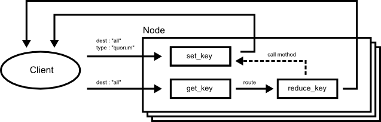
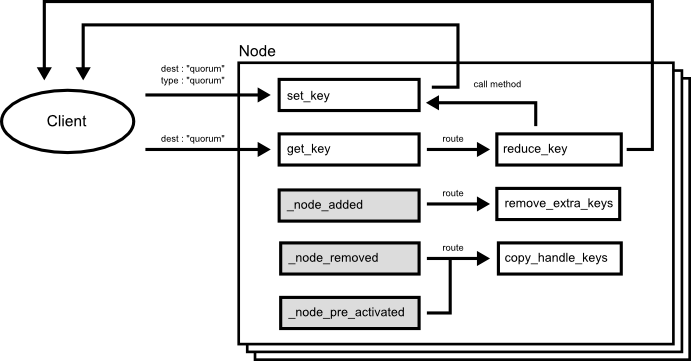

# Applications

## Dynamic DNS

## DNS Server

## Time Server

## Chubby

The sample is a simple distributed key value store to small data such as configuration data like Google's chubby [1]. The sample is based on [Quorum Pattern](./round_design_pattern.md).

## CDN (Contents Delivery Network)

## Key Value Store

## Search Engine

## NoSQL Database

# Refferences

[1] :  M. Burrows, “The Chubby lock service for loosely-coupled distributed
systems,” in OSDI ’06: Proceedings of the 7th symposium on Operating
systems design and implementation, 2006, pp. 335–350.
