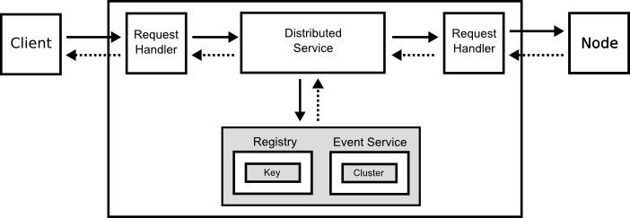
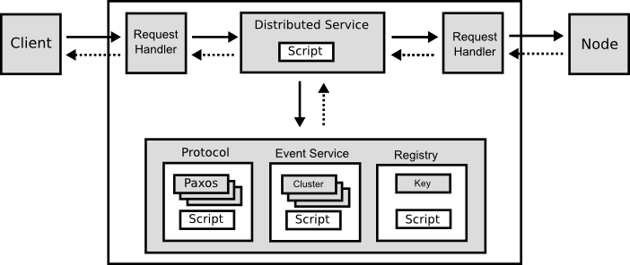

English [Japanese](round_conversions_jp.md)

# Conversions

## Round Programming Model

Round is designed to develop any distributed applications using the single programming model. The programming model is a computer which has some programmable engines with a memory, and it can receive and send messages with other nodes and clients.

## Existing Consensus Services

The existing distributed consensus service such as [Chubby \[1\]][1], [ZooKeeper \[2\]][2] supports the only following basic functions to build distributed applications.

### Functions

#### Lock Service

#### Event

The event service sends only the following notifications when other node status is changed.

- Node Created
- Node Deleted
- Node Data Changed
- Node Children Changed

The events are limited and static. In contrast, Round supports more useful events, developer can add user events easily.

#### Registry

### Round Functions

## Existing Genaral Distributed Framework

In the existing distributed framework such as [MapReduce \[2\]][2] and [Storm \[4\]][4] ....

[MapReduce \[2\]][2] ....
[Storm \[4\]][4] ....

## Existing Distributed Service Framework

## Network Topology

Programming model of existing consensus services, like [Chubby \[1\]][1] and [Zookeeper \[4\]][4], are typical client server model.

[MapReduce \[2\]][2] ...

Round ...

Asymmetric network topology is not always efficient ...

# Conversion

| Category | Feature | Round | [ZooKeeper \[1\]][1] | Consul | etcd | Chubby |
|---|---|---|---|---|---|
| Basic | Implementation | C++ | Java | Go | Go | ? |
| Notification | Synchronous | Asynchronous | Synchronous | | Synchronous | Synchronous |
| Consensus Protocol | Paxos | O | O [1] | X | X | |
| | [Raft][raft] | X | O [1] | [Raft][raft] | Raft |  |
| Membership | Multicast | O | (none) | [O][gossip-consul] | ? | (?) |
| | Gossip | O | X | X | X |  |  |

## Refrences

- \[1\] : [Mike Burrows, Chubby Distributed Lock Service, OSDI'06, 2006][1]
- \[2\] : [Apache ZooKeeper][2]
- \[3\] : [Jeffrey Dean and Sanjay Ghemawat, MapReduce: Simplified Data Processing on Large Clusters, OSDI'04, 2004][2]
- \[4\] : [Apache Storm][3]
- \[5\] : [Conway's Game of Life][5]
- \[6\] : [Pipeline (Unix)][6]

[1]: http://research.google.com/archive/chubby.html
[2]: http://zookeeper.apache.org/
[3]: http://research.google.com/archive/mapreduce.html
[4]: https://storm.apache.org/
[5]: http://en.wikipedia.org/wiki/Conway%27s_Game_of_Life
[6]: http://en.wikipedia.org/wiki/Pipeline_%28Unix%29

[raft]: https://raftconsensus.github.io/
[raft-consul]: http://www.consul.io/docs/internals/consensus.html
[gossip-consul]: http://www.consul.io/docs/internals/gossip.html
