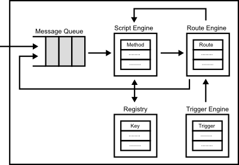

[English](round_conversions.md) Japanese

# 既存分散フレームワークとの相違点

## プログラミングスタイル

Programming model of Round is inspired from some programming models, [Actor model][actor-model], CSP ([Communicating Sequential Processes][csp]) and [Dataflow Programming][df-prog].

Each node of Round is an actor which has a message queue to receive messages from clients or other nodes.

### 自律的

既存のChubbyやZookepperなどのコンセンサスサービスは、簡単な共有メモリをもち発生するイベントに対してプログラミンングをするスタイルをとります。プログラムは静的なもので、プログラミングコードはコンセンサスサービスとは独立しています。

既存のコンセンサスサービスが受動的なプログラミングスタイルであるのに対して、Roundでは[ライフゲーム](http://ja.wikipedia.org/wiki/%E3%83%A9%E3%82%A4%E3%83%95%E3%82%B2%E3%83%BC%E3%83%A0)のように自律的なノードを定義するプログラミングスタイルをとります。

Roundには、ノードの概念があり、既存のコンセンサスサービスと同様に共有メモリとイベントが定義されていますが、プログラミングコードもノード内に設定するプログラミングスタイルをとります。また既存のイベントに加えて、ノード自身が新しいイベントを発生させることも可能です。

### 単機能

既存の分散アプリケーション開発は、一般的には複雑になりがちです。例えば、ある機能を追加したり改善したい場合には、その分散アプリケーションの全体構造を理解する必要があります。

Roundでは[Unixパイプ](http://ja.wikipedia.org/wiki/%E3%83%91%E3%82%A4%E3%83%97_%28%E3%82%B3%E3%83%B3%E3%83%94%E3%83%A5%E3%83%BC%E3%82%BF%29)のように単機能なメソッドを定義して、それらを組み合わせることにより複雑な機能を実装するプログラミングスタイルをとります。具体的には、ノードに単機能なメソッドを定義して、それらをRPCバッチやルート機能により組みわせていきます。

これらの各メソッドはRPCモジュールとして、関数的に明確に入出力が定義されています。そのため、Roundで既存の機能を改善する場合には、そのメソッドの関数的仕様を満たす新しいメソッドを作成して、そのモジュールと入れ替えることで実現します。

Roundでは、必ずしも既存の分散アプリケーションの全体構造を理解する必要はなく、単なるモジュールとイベントに対してのプログラミング作業に注力できます。

### 動的

既存の分散アプリケーション開発は、一般的にC言語やJavaなどのプログラミング言語により、静的なアプリケーションとして開発されています。

Roundでは、動的プログラミング言語により分散アプリケーションを開発でき、動的にアプリケーションを更新することが可能です。また、従来のようにC++言語などのプログラミング言語による、静的なアプリケーション開発も可能です。

また、動的なプログラミング言語はJavaやJavaScript、Tclなどの多様なプログラミング言語がサポートされていますので、開発者は自分の得意なプログラミング言語や、対象アプリケーションに最適なプログラミング言語を選択して、分散アプリケーションが開発できます。

### 再利用性

Roundのモジュールは、動的なスクリプト言語の場合にはテキスト形式で記述したものが、そのまま利用できます。例えば、あなたが開発したモジュールをインターネットで配布すると、他の開発者が用意の再利用できます。また、他の開発者もモジュールが配布されている場合には、あなたの分散アプリケーションでも容易に再利用可能です。

# Other Consensus Services

## Conversion

| Category | Feature | Round | [ZooKeeper \[1\]][1] | Consul | etcd | Chubby |
|---|---|---|---|---|---|
| Basic | Implementation | C++ | Java | Go | Go | ? |
| Notification | Synchronous | Asynchronous | Synchronous | | Synchronous | Synchronous |
| Consensus Protocol | Paxos | O | O [1] | X | X | |
| | [Raft][raft] | X | O [1] | [Raft][raft] | Raft |  |
| Membership | Multicast | O | (none) | [O][gossip-consul] | ? | (?) |
| | Gossip | O | X | X | X |  |  |

## Refrences

\[1\] : [Apache ZooKeeper][1]

[1]: http://zookeeper.apache.org/
[raft]: https://raftconsensus.github.io/
[raft-consul]: http://www.consul.io/docs/internals/consensus.html
[gossip-consul]: http://www.consul.io/docs/internals/gossip.html
[upnp-spec]: http://upnp.org/sdcps-and-certification/standards/
[json-rpc]: http://www.jsonrpc.org/specification
[json-rpc-http]: http://jsonrpc.org/historical/json-rpc-over-http.html
[java]: https://java.com/
[js-spec]: http://www.ecma-international.org/publications/standards/Ecma-262.htm
[js-v8]: https://developers.google.com/v8/
[zero-conf]: http://www.zeroconf.org/
[rpc]: http://en.wikipedia.org/wiki/Remote_procedure_call
[seda]: http://dl.acm.org/citation.cfm?id=502057
[actor-model]: http://en.wikipedia.org/wiki/Actor_model
[csp]: http://en.wikipedia.org/wiki/Communicating_sequential_processes
[df-prog]: http://en.wikipedia.org/wiki/Dataflow_programming
[mupnp]: http://www.cybergarage.org/do/view/Main/CyberLinkForCC
[uhttp]: http://www.cybergarage.org/do/view/Main/HttpEngineForCC
[usql]: http://www.cybergarage.org/do/view/Main/SqlEngineForCC
