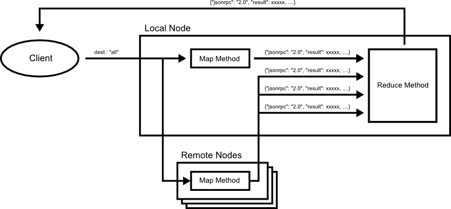

# Design Patterns

## Default

### Default Parameters

### Configuration

## Execution

### Map Reduce

### Diagram



### Script

```
{
  methods : [
    {jsonrpc : "2.0", "method":"map_method", ....}
    {jsonrpc : "2.0", "method":"filter_method", ....}
  ]

  routes : [
    {src : "exec_method", dest : "filter_method"}
  ]
}
```

### Quorum

### Diagram


#### Script

```
{
  methods : [
    {jsonrpc : "2.0", "method":"exec_method", ....}
    {jsonrpc : "2.0", "method":"filter_method", ....}
  ]

  routes : [
    {src : "exec_method", dest : "filter_method"}
  ]
}
```

### Transaction

### Client Centric Consistency

such as eventual consistency.

### Mult Cluster

Map Reduce Pattern

### Transaction

JSON-RPC batch

## Decide

### Vote

### Election

## Failer Detection

### Node Repair

### Failer Detection

### Immutable

In distributed system
