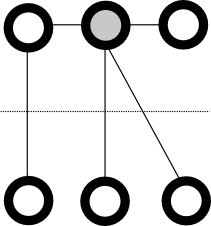
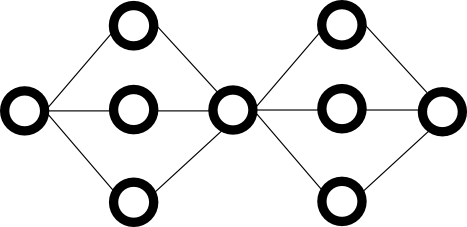
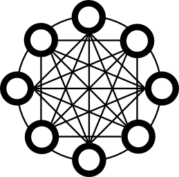

English [Japanese](round_conversions_jp.md)

# Features

## Programming Model

Round is designed to develop any distributed applications using the single programming model. The programming model is a computer which has some programmable engines with a memory, and it can receive and send messages with other nodes and clients.

## Network Topology

Programming model of existing consensus services, like [Chubby \[1\]][1] and [Zookeeper \[4\]][4], are typical client server model.

[MapReduce \[2\]][2] ...

Round ...

Asymmetric network topology is not always efficient ...

## Zeroconf

In typical cloud systems, users have to set some configuration to start distributed services. Round is designed not to set configurations by users using Zeroconf.

Zeroconf is a tecnology to find services without user configuration.　In Round, all new nodes are added into a cluster without special configuration and the nodes are available automatically.

## Decentralized

Round is a decentralized and distributed system,
every nodes in a cluster has equal roll, the cluster has no master node.

In typical distributed systems such as consensus services are centric which has a master node. However, Round has no master node.

## Autonomous

Programming model of existing consensus services, like [Chubby \[1\]][1] and [Zookeeper \[4\]][4], has a simple shared key value store and notifies some provided network events. The programming codes which handles the provided events are separated the consensus services.

Against the existing consensus service is a passive programming model, Round is a autonomous programming model like [Game of Life \[3\]][3]. Round includes programming codes in the node. The node can handle the provided events and occur original events itself.

## Dynamics

In the typical distributed programming, developers create the distributed applications as static using some static programming languages such as Java and C.

In Round, developers can create the applications using dynamic programming languages, and update the programming codes in the nodes dynamically. Developers can select the favorite programming language to create the applications because Round supports many dynamic and static programming languages such Java, JavaScript, Lua and C++.

## Simplicity

Generally, it is difficult to maintain distributed applications because developers have to understand the distributed framework and applications for updating the functions.

In Round, developer can update the functions easily without understanding the distributed framework and applications because the all methods are defined as RPC. To update the function, developer have to understand only the method input and output interfaces.

Round recommends to create the methods simply. To create complex functions, connect the simple methods using the route function like [Unix pipelines \[5\]][5].

## Code reuse

Developers can distribute the methods which are created dynamic programming languages, and the other developer can import the methods easily. For example, a developer releases programming codes of their methods on Github, the other developers can import the methods easily using rpm command.

## Conversion

| Category | Feature | Round | [ZooKeeper \[1\]][1] | Consul | etcd | Chubby |
|---|---|---|---|---|---|
| Basic | Implementation | C++ | Java | Go | Go | ? |
| Notification | Synchronous | Asynchronous | Synchronous | | Synchronous | Synchronous |
| Consensus Protocol | Paxos | O | O [1] | X | X | |
| | [Raft][raft] | X | O [1] | [Raft][raft] | Raft |  |
| Membership | Multicast | O | (none) | [O][gossip-consul] | ? | (?) |
| | Gossip | O | X | X | X |  |  |

## Refrences

- \[1\] : [Mike Burrows, Chubby Distributed Lock Service, OSDI'06, 2006][1]
- \[2\] : [Jeffrey Dean and Sanjay Ghemawat, MapReduce: Simplified Data Processing on Large Clusters, OSDI'04, 2004][2]
- \[3\] : [Apache Storm][3]
- \[4\] : [Apache ZooKeeper][1]
- \[5\] : [Conway's Game of Life][5]
- \[6\] : [Pipeline (Unix)][6]

[1]: http://research.google.com/archive/chubby.html
[2]: http://research.google.com/archive/mapreduce.html
[3]: https://storm.apache.org/
[4]: http://zookeeper.apache.org/
[5]: http://en.wikipedia.org/wiki/Conway%27s_Game_of_Life
[6]: http://en.wikipedia.org/wiki/Pipeline_%28Unix%29

[raft]: https://raftconsensus.github.io/
[raft-consul]: http://www.consul.io/docs/internals/consensus.html
[gossip-consul]: http://www.consul.io/docs/internals/gossip.html
