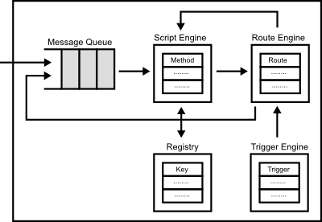

# Round Internals

## Architecture Overview

### Open Architecture

Round consists only some open standard network protocols such as [UPnP][upnp] and [JSON-RPC][json-rpc] with standard script engines such as [Java][java] and [JavaScript][v8].

[java]: https://java.com/
[js]: http://www.ecma-international.org/publications/standards/Ecma-262.htm
[v8]: https://developers.google.com/v8/

#### Zeroconf

Round is designed based on [Zeroconf](http://www.zeroconf.org/) concept to achieve automatically scalable distributed systems. Specifically, Round uses [UPnP][upnp], Universal Plug and Play, as [Zeroconf](http://www.zeroconf.org/) protocol.

Using the [Zeroconf](http://www.zeroconf.org/) protocol,  

[upnp]: http://upnp.org

#### Messaging

Each Node communicates to other nodes in the same cluster using [RPC (remote procedure call)](http://en.wikipedia.org/wiki/Remote_procedure_call) over HTTP, HTTPU.

Check [Round RPC Specification](./round_rpc.md) and [Round RPC Methods](./round_rpc_methods.md)

#### Staging

The received message is split into multiple stages similar to the SEDA [[??]][seda] architecture.

[??] [Welsh, M., Culler, D., and Brewer, E. 2001. SEDA: an architecture for well-conditioned, scalable internet services][seda].

[seda]: http://dl.acm.org/citation.cfm?id=502057

### JSON-RPC

Node includes a local HTTP server to handle requests form other node or client. The HTTP server has [RESTful](http://en.wikipedia.org/wiki/Representational_state_transfer) interfaces using [JSON-RPC 2.0](http://www.jsonrpc.org/specification), so you can request ..... , For efficient communication for between the nodes, we will support more efficient remote procedure call like  [BSON](http://bsonspec.org) in the future release.

### Dynamic Interface

Round

Round has a JavaScrpit engine based on [V8](http://en.wikipedia.org/wiki/V8_\(JavaScript_engine\) to define basic strategies such as structured network and failure detection.

### Native Interface

## Dynamics

Dynamic Configuration

Basically, Round supports only to define node methods, and developer can build their distributed application to add the application methods.

Some coordinating frameworks for distributed systems such as [ZooKeeper](http://zookeeper.apache.org) are based on notification events using synchronous connection. In Round, even the notification events are implemented as the node methods without the synchronous connection.

## Network Topology

Round is based on [consistent hasing](http://en.wikipedia.org/wiki/Consistent_hashing), and each node has a hash code. The hash code is generated based on a ip address and a port of the node using [SHA-256](http://en.wikipedia.org/wiki/SHA-2) algorithm statically. In current version, Round supports only a simple ring network topology based on the hash code as the following.

In the current verion, Round supports only the simple network topology, but we will supports other structured network topology. Then, the hash code is generated statically, but we will add the customize methods for the hash seed and algorithm too.

## Programming Model

Programming model of Round is based on some programming model such as [actor model](http://en.wikipedia.org/wiki/Actor_model) and [dataflow programming](http://en.wikipedia.org/wiki/Dataflow_programming). Each node of Round is an actor which has a message queue to receive messages from clients or other nodes.

Because of the programming model,
## Scripting

Each node can be received messages from client and other nodes, and the messages are executed by the script engine in the node. The script engine supports some dynamic and static programming languages such as JavaScript, Java, Tcl, and C++.

Using the supported programming languages, user can implement

### Trigger

### Routing

The each node can propagate a received message from clients or other nodes to other nodes or local methods using 'route'. The route can chain like pipelien of Unix.

### Staging

The received message is split into multiple stages similar to the SEDA [[??]][seda] architecture.

[??] [Welsh, M., Culler, D., and Brewer, E. 2001. SEDA: an architecture for well-conditioned, scalable internet services][seda].

[seda]: http://dl.acm.org/citation.cfm?id=502057

## Consensus Protocol

Round supports some consensus protocol, [2PC](http://en.wikipedia.org/wiki/Two-phase_commit_protocol) and [Paxos](http://en.wikipedia.org/wiki/Paxos_(computer_science), to provide consistency.

### 2PC (Two phase commit protocol)

### Paxos

Each node acts in three roles; Proposer, Acceptor and Learner in Paxos to reduces the message complexity significantly.

## Failure Detection

Any node can vote a failure suspicion into other nodes in the same cluster when the voted node suspects failure to other node or itself.

The algorithm of failure detection is programmable.

## Interface

## Security

Round supports a security model based on [HMAC](https://tools.ietf.org/html/rfc2104) to reject unreliable messages from evil users.

The node
a session key.
