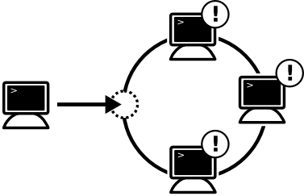
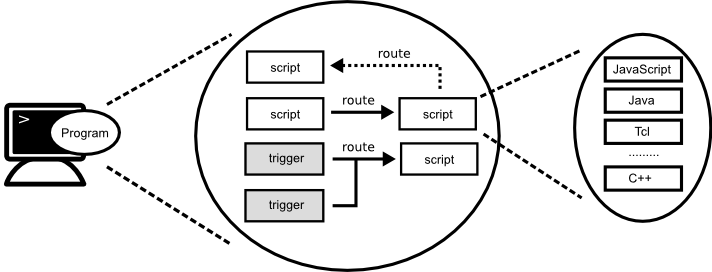

English [Japanese](round_overview_jp.md)

# Overview

## What is Round ?

Round is a new open source framework developed for distributed system developers and researchers to build distributed applications concisely.

The name "Round" derives from "[Knights of the Round Table](http://en.wikipedia.org/wiki/Round_Table)", meaning that every node in a cluster has an equal role and the cluster has no mater node.

## Design Principles

Round is designed on the basis of the following principles.

### Simplicity

Simplicity is the most valued principle. The core module of Round is very simple, and has only minimum functions are implemented.

Orthogonality is another important one as well as simplicity. Considering those principles, no redundancy functions are implemented to keep the core module simple.

### Clarity

The technical specifications of the core module are clearly defined and released free for users. Basically, the specifications are defined to extend some de facto standard specifications.

The initial version is implemented with C++, whereas the core module can be done with other programming languages such as Java and Go based on the public specifications.

## Design Features

### Zeroconf

In typical cloud systems, users have to set some configuration to start distributed services. Round is designed not to set configurations by users using Zeroconf.

Zeroconf is a tecnology to find services without user configuration.　In Round, all new nodes are added into a cluster without special configuration and the nodes are available automatically.

### Decentralized

Round is a decentralized and distributed system,
every nodes in a cluster has equal roll, the cluster has no master node.

In typical distributed systems such as consensus services are centric which has a master node. However, Round has no master node.

### Autonomous

Each node run as an autonomous agent based on the specified behaviors by programming. They communicates synchronously or asynchronously messages to other nodes based on the specified behaviors autonomously.

### Dynamics

The behaviors of node are defined using some dynamic and static programming language scripts, the behaviors can be changed to send the programming scripts dynamically.

## Support Functions

Round offers the following functions to develop distributed system application easily.

### Auto Configuration

New Round node is stared, it is added into a network automatically. Other nodes in the same network are received some event messages when a node is added or removed.

In addition to the auto configuration, Round supports none auto configuration network and static configurations too.

### Dynamic Programming

Round node is a programmable RPC([Remote Procedure Call](http://en.wikipedia.org/wiki/Remote_procedure_call)) node.
In Round, you can build distributed system applications to add programming scripts and connect events into the scripts dynamically.

Roundのノードはプログラミング可能なノードです。Roundでは、各ノードに動的にスクリプトを設定したり、そのスクリプトをイベントに関連付けたりしながら、分散システムアプリケーションを構築していきます。

Round supports some dynamic programming languages such ad JavaScript and Java, then you can develop distributed system applications using your favorite programming language. It supports some programming languages such C++.

Monochrome iconset by [Danny Allen](http://dannya.org).
