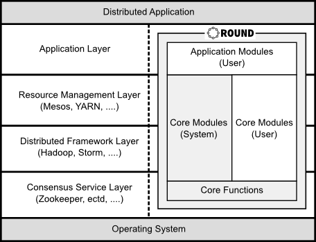

English [Japanese](round_overview_jp.md)

# Overview

## What is Round ?

Round is a new open source framework developed for distributed system developers and researchers to build distributed applications concisely.

The name "Round" derives from "[Knights of the Round Table](http://en.wikipedia.org/wiki/Round_Table)", meaning that every node in a cluster has an equal role and the cluster has no mater node.

Round is a new basic framework, supports to develop various　distributed systems such as the following:

- Consensus Services (Chubby, ZooKeeper, etcd, ...)
- Distributed Frameworks (Hadoop, Storm, Spark ...)
- Distributed File Systems (GFS, HDFS, ...)
- Distributed Database Systems (Dynamo, Cassandra, ...)

## Design Overview

### Principles

Round is designed on the basis of the following principles.

#### Simplicity

Simplicity is the most valued principle. The core module of Round is very simple, and has only minimum functions are implemented.

Orthogonality is another important one as well as simplicity. Considering those principles, no redundancy functions are implemented to keep the core module simple.

#### Clarity

The technical specifications of the core module are clearly defined and released free for users. Basically, the specifications are defined to extend some de facto standard specifications.

The initial version is implemented with C++, whereas the core module can be done with other programming languages such as Java and Go based on the public specifications.

### Scope

Round's core functions are very small like [Microkernel](http://en.wikipedia.org/wiki/Microkernel), and the all other extra functions for developing distributed systems or applications are implemented as core modules. Developers can build distributed applications using the core functions and modules as the following.

Round supplies some useful core modules such as consensus protocols and failure detections as default. In addition, developers can build original distributed frameworks or consensus services to add developer's original core modules using any programming languages such as JavaScript and Lua.

## Architecture Overview

### Programming Model

Programming model of Round is based on [Actor model][actor-model]. Round's cluster is consist of several nodes, and the each node is an actor which has a message queue to receive messages from clients or other nodes.

### Open Standard Protocols

Round consists only some open standard network protocols such as [UPnP][upnp-spec] and [JSON-RPC][json-rpc] with standard script engines such as [Java][java] and [JavaScript][js-spec].

##  Features

Round has the following features to develop distributed system application easily.

### Auto Configuration

New Round node is stared, it is added into a network automatically. Other nodes in the same network are received some event messages when a node is added or removed.

In addition to the auto configuration, Round supports none auto configuration network and static configurations too.

#### Autonomous

Each node run as an autonomous agent based on the specified behaviors by user programming. They communicates synchronously or asynchronously messages to other nodes based on the specified behaviors autonomously.

[actor-model]: http://en.wikipedia.org/wiki/Actor_model
[csp]: http://en.wikipedia.org/wiki/Communicating_sequential_processes
[df-prog]: http://en.wikipedia.org/wiki/Dataflow_programming
[upnp-spec]: http://upnp.org/sdcps-and-certification/standards/
[json-rpc]: http://www.jsonrpc.org/specification
[java]: https://java.com/
[js-spec]: http://www.ecma-international.org/publications/standards/Ecma-262.htm

### Dynamic Programming

Round node is a programmable RPC ([Remote Procedure Call](http://en.wikipedia.org/wiki/Remote_procedure_call)) node.
In Round, you can build distributed system applications to add programming scripts and connect events into the scripts dynamically.

Round supports some dynamic programming languages such ad JavaScript and Java, then you can develop distributed system applications using your favorite programming language. It supports some programming languages such C++.
