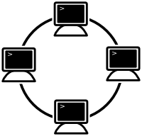
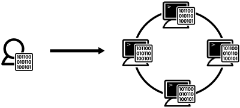

English [Japanese](round_overview_jp.md)

# Overview

## What is Round ?

Round is a new open source framework developed for distributed system developers and researchers to build distributed applications concisely.

The name "Round" derives from "[Knights of the Round Table](http://en.wikipedia.org/wiki/Round_Table)", meaning that every node in a cluster has an equal role and the cluster has no mater node.

## Design Principles

Round is designed on the basis of the following principles.

### Simplicity

Simplicity is the most valued principle. The core module of Round is very simple, and has only minimum functions are implemented.

Orthogonality is another important one as well as simplicity. Considering those principles, no redundancy functions are implemented to keep the core module simple.

### Clarity

The technical specifications of the core module are clearly defined and released free for users. Basically, the specifications are defined to extend some de facto standard specifications.

The initial version is implemented with C++, whereas the core module can be done with other programming languages such as Java and Go based on the public specifications.

## Design Features

### Zeroconf

In typical cloud systems, some configurations such as the ip address and the service port are needed to add a new node manually, but the manual configurations are obstacle for auto scale distributed systems. In Round, all new nodes are added into a cluster without special configuration and the nodes are available soon automatically.

In Round, some noficication events are defined for the node statues. When a node status is changed, the notification message is sent to all other nodes  in the same cluster. For example, each existing node is recieved a notirication message when a new node is added or removed.

### Decentralized

Round is a decentralized and distributed system, every nodes in a cluster has equal roll, the cluster has no master node. In typical distributed systems are centric, they has a master node.

### Dynamics

The behaviors of node are defined using a dynamic programming language script, so the distributed strategies and algorithms are configurable dynamically. To send a script, developers can change the strategy and algorithm of all nodes in the cluster dynamically.

### Autonomous

Each node run as an autonomous agent in the cluster, a node communicate to other nodes based on the specified behaviors using the message protocol synchronously or asynchronously.

The some basic behaviors are defined as default, and developers can override the default behaviors or add new behaviors using some programming languages such as JavaScript or Java.

## Support Functions

Round supports the following functions to develop distrubted applications or systems.

### Auto Configuration

To add a new node into a cluster.

### Service Discovery

### Dynamic Configuration

### Messaging

Node can communicate to other nodes in the same cluster using [RPC (remote procedure call)](http://en.wikipedia.org/wiki/Remote_procedure_call).

### Security

Monochrome iconset by [Danny Allen](http://dannya.org).
