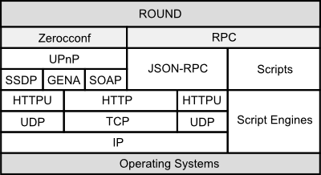
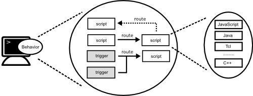

[English](round_overview_jp.md) Japanese

# 概要

## Roundとは ?

Roundは分散システム開発者や研究者向けの新しいオープンソースのフレームワークです。 Roundは、利用者が簡潔に分散アプリケーションを開発するのを支援します。

Roundの名前は「[円卓の騎士](http://ja.wikipedia.org/wiki/円卓の騎士)」に由来しており、クラスターの全てのノードが等しい役割を持ち、マスターノードが存在していないことを意味しています。

Roundは、分散アプリケーション開発の基盤フレームワークであり、以下のような多種多様な分散アプリケーションの開発を支援します。

- コンセンサスサービス (Chubby, ZooKeeper, etcd ...)
- 分散処理フレームワーク (Hadoop, Storm, Spark ...)
- 分散ファイルシステム (GFS, HDFS, ...)
- 分散データベース (Dynamo, Cassndra, ...)

## 設計原則

Roundは以下の原則に基づいて設計されています。

### 簡潔性

簡潔性は重要な原則の一つです。Roundのコアモジュールは極めてシンプルであり最低限の機能のみ実装されています。簡潔さに関連する直交性も重要な原則です。これらの原則により、コアモジュールを簡潔に保つために、冗長な機能は実装されません。

### 明確性

コアモジュールの技術仕様については明確に定義されており利用者に公開されています。技術仕様は業界標準のネットワークプロトコルを拡張して定義されています。

コア機能の初期バージョンはC++で実装されていますが、公開されている技術仕様から、JavaやGoなどの他のプログラミング言語でコアモジュールを実装することも可能です。

## 対象領域

Roundのコア機能は非常に小さく、分散システムやアプリケーション開発に必要となるその他の基本的な全てのファンクションはコアモジュールとして提供されています。開発者は分散フレームワークやアプリケーションをコア機能やコアモジュールを利用して構築できます。

Roundは、標準で分散システムのコンセンサスプロトコルや障害検知のような有用なコアモジュールを提供しています。また、開発者はコンセンサスプロトコルなどの新しい分散システムの独自モジュールを、JavaScriptやLuaなどの色々なプログラミング言語を用いて追加できます。

## Architecture Overview

### Programming Model

Programming model of Round is based on [Actor model][actor-model]. Round's cluster is consist of several nodes, and the each node is an actor which has a message queue to receive messages from clients or other nodes.

### Open Standard Protocols

Round consists only some open standard network protocols such as [JSON-RPC][json-rpc] and [UPnP][upnp-spec] with standard script engines such as [Java][java] and [JavaScript][js-spec].

## 特徴

### Zeroconf

一般的なクラウドシステムでは、分散サービスを起動するために利用者による設定が必要となります。RoundではZeroconfにより利用者による設定を極力不要になるよう設計されています。

Zeroconfとは、利用者による設定が不要な、サービス発見の技術です。Roundでは、すべての新規ノードは特別な設定なしにクラスターに追加され、自動的に利用可能となります。

### 非集中型

Roundは非集中型の分散システムで、クラスターにある全てのノードは等しい役割を持ちます。 典型的な幾つかのコンセンサスサービスのような分散システムは集中型でマスターノードが存在しますが、Roundにはマスターノードは存在しません。

### 自律的

各ノードは指定されたプログラミングにより指定された振る舞いにによる自律的なエージェントとして動作します。各ノードは指定された振る舞いにより、他ノードと同期または非同期のメッセージを自律的に交換します。

### 動的

ノードの振る舞いは、動的または静的なプログラミング言語で定義されます。各ノードにプログラミング言語スクリプトを送信することにより、動的に振る舞いを変更できます。

## 提供機能

Roundは、分散システムアプリケーションを簡単に開発するために以下の機能を提供します。

### 分散プログラミング

Roundでは、分散アプリケーション開発に必要となる分散アルゴリズムをサポートしています。

- リーダー選出
- コンセンサスアルゴリズム (Paxos, Two-Phase Commit, ....)
- ....

### 動的プログラミング

Roundのノードはプログラミング可能なRPC([Remote Procedure Call](http://en.wikipedia.org/wiki/Remote_procedure_call))ノードです。Roundでは、各ノードに動的にスクリプトを追加したり、イベントをそのスクリプトに関連付けたりしながら、分散システムアプリケーションを構築していきます。

### 複数プログラミング言語対応

RoundはJavaScritやJavaなどの複数の動的プログラミング言語に対応していますので、利用者の好みのプログラミング言語で分散システムアプリケーションが開発できます。C++などの静的プログラミング言語にも対応しています。

### 自動認識

新しく起動されたRoundノードは、ネットワークに自動的に追加されます。同じネットワークの他のノードは、ノードが追加されたり削除されたりすると、そのイベントを受信します。

Roundは、自走設定に以外にも自動設定でないネットワークや固定的な設定にも対応しています。

[actor-model]: http://en.wikipedia.org/wiki/Actor_model
[csp]: http://en.wikipedia.org/wiki/Communicating_sequential_processes
[df-prog]: http://en.wikipedia.org/wiki/Dataflow_programming
[upnp-spec]: http://upnp.org/sdcps-and-certification/standards/
[json-rpc]: http://www.jsonrpc.org/specification
[java]: https://java.com/
[js-spec]: http://www.ecma-international.org/publications/standards/Ecma-262.htm
