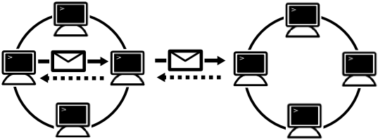

[English](round_overview_jp.md) Japanese

# 概要

## Roundとは ?

Roundは分散システム開発者や研究者向けの新しいオープンソースのフレームワークです。 Roundは、利用者が簡潔に分散アプリケーションを開発するのを支援します。

Roundの名前は「[円卓の騎士](http://ja.wikipedia.org/wiki/円卓の騎士)」に由来しており、クラスターの全てのノードが等しい役割を持ち、マスターノードが存在していないことを意味しています。

## 設計原則

Roundは以下の原則に基づいて設計されて``います。

### 簡潔性

簡潔性は重要な原則の一つです。Roundのコアモジュールは極めてシンプルであり最低限の機能のみ実装されています。簡潔さに関連する直交性も重要な原則です。これらの原則により、コアモジュールを簡潔に保つために、冗長な機能は実装されません。

### 明確性

コアモジュールの技術仕様については明確に定義されており利用者に公開されています。技術仕様は業界標準のネットワークプロトコルを拡張して定義されています。

Roundの初期バージョンはC++で実装されていますが、公開されているRoundの技術仕様から、JavaやGoなどの他のプログラミング言語でコアモジュールを実装することも可能です。

## 設計の特徴

### Zeroconf

一般的なクラウドシステムでは、分散サービスを起動するために利用者による設定が必要となります。RoundではZeroconfにより利用者による設定を極力不要になるよう設計されています。

Zeroconfとは、利用者による設定が不要な、サービス発見の技術です。Roundでは、すべての新規ノードは特別な設定なしにクラスターに追加され、自動的に利用可能となります。

### 非集中型

Roundは非集中型の分散システムで、クラスターにある全てのノードは等しい役割を持ちます。 典型的な幾つかのコンセンサスサービスのような分散システムは集中型でマスターノードが存在しますが、Roundにはマスターノードは存在しません。

### 自律的

各ノードは指定されたプログラミングにより指定された振る舞いにによる自律的なエージェントとして動作します。各ノードは指定された振る舞いにより、他ノードと同期または非同期のメッセージを自律的に交換します。

### 動的

ノードの振る舞いは、動的または静的なプログラミング言語で定義されます。各ノードにプログラミング言語スクリプトを送信することにより、動的に振る舞いを変更できます。

## Support Functions

Round supports the following functions to develop distrubted applications or systems.

### Auto Configuration

To add a new node into a cluster.

### Service Discovery

### Dynamic Configuration

### Messaging

Node can communicate to other nodes in the same cluster using [RPC (remote procedure call)](http://en.wikipedia.org/wiki/Remote_procedure_call).

### Security

Monochrome iconset by [Danny Allen](http://dannya.org).
