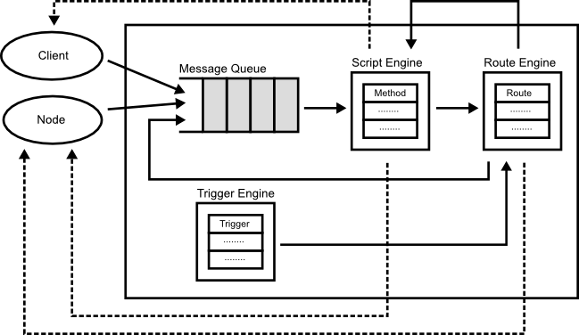

## Programming Model

Programming model of Round is based on some programming model such as [actor model](http://en.wikipedia.org/wiki/Actor_model) and [dataflow programming](http://en.wikipedia.org/wiki/Dataflow_programming). Each node of Round is an actor which has a message queue to receive messages from clients or other nodes.

Because of the programming model,
## Scripting

Each node can be received messages from client and other nodes, and the messages are executed by the script engine in the node. The script engine supports some dynamic and static programming languages such as JavaScript, Java, Tcl, and C++.

Using the supported programming languages, user can implement

### Trigger

### Routing

The each node can propagate a received message from clients or other nodes to other nodes or local methods using 'route'. The route can chain like pipelien of Unix.

### Staging

The received message is split into multiple stages similar to the SEDA [[??]][seda] architecture.

[??] [Welsh, M., Culler, D., and Brewer, E. 2001. SEDA: an architecture for well-conditioned, scalable internet services][seda].

[seda]: http://dl.acm.org/citation.cfm?id=502057
